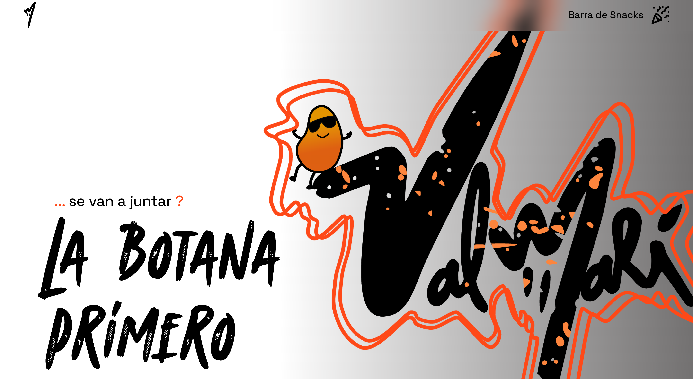

<div align="center">
  
  
  # 🎉 Valmarí - Barra de Snacks Premium
  
  ### *La botana primero*
  
  [](https://valmarisnack.netlify.app/)
  [](https://astro.build)
  [](https://tailwindcss.com)
  
  [🌐 Ver Sitio en Vivo](https://valmarisnack.netlify.app/) • [📱 Instagram](https://www.instagram.com/valmari138/) • [📘 Facebook](https://www.facebook.com/val.mari.962965)
  
</div>

---

## 📖 Sobre el Proyecto

**Valmarí** es un sitio web moderno y dinámico creado para un emprendimiento local de barras de snacks premium en Guadalajara, Jalisco. Este proyecto nace con el objetivo de **posicionar localmente** un pequeño negocio en el competitivo mercado digital de eventos y fiestas en GDL.

### 🎯 Objetivos Principales

1. **SEO Local Optimizado**: Posicionamiento en búsquedas clave como:
   - "barra de snacks gdl"
   - "eventos guadalajara"
   - "candy bar guadalajara"
   - "mesa de dulces gdl"

2. **Diferenciación Visual**: En un mercado saturado de sitios web genéricos, Valmarí se destaca con:
   - Animaciones fluidas y modernas
   - Transiciones interactivas únicas
   - Diseño personalizado que refleja la identidad de marca
   - Experiencia de usuario memorable

3. **Conversión y Engagement**: Diseño enfocado en captar la atención y generar interés en los servicios ofrecidos.

---

## ✨ Características Destacadas

### 🎨 Animaciones y Transiciones Únicas

El sitio implementa varias animaciones personalizadas que lo diferencian de la competencia:

#### 1. **Animación del Logo con Scroll** (`hero.astro`)
```css
@keyframes change-logo {
  0%   { scale: 1.4; }
  50%  { scale: 0.5; }
  100% { scale: 0; }
}
```
- El logo principal se escala dinámicamente mientras el usuario hace scroll
- Utiliza `animation-timeline: scroll(block)` para sincronizar con el desplazamiento
- Crea una experiencia inmersiva y moderna

#### 2. **Líneas Animadas del Logo**
```css
@keyframes move-line-x {
  from { transform: translateX(8px); }
  to   { transform: translateX(0); }
}

@keyframes move-line-y {
  from { transform: scale(1.02) translateY(0); }
  to   { transform: scale(1) translateY(0); }
}
```
- Las líneas naranjas del logo se mueven sutilmente en bucle infinito
- Movimiento alternado en ejes X e Y
- Añade dinamismo visual sin ser intrusivo

#### 3. **Cards Interactivas de Paquetes** (`Packs.astro`)
```css
hover:transform hover:translate-x-6 hover:-translate-y-6 
hover:bg-transparent duration-500 ease-in-out
```
- Al pasar el mouse, las tarjetas se desplazan creando un efecto 3D
- Revelan información adicional con transiciones suaves
- Texto rotado que aparece lateralmente con efecto de "Apartar fecha"
- Cambio de opacidad en descripciones para mostrar detalles y precios

#### 4. **Navbar con Backdrop Blur**
```css
backdrop-filter: blur(20px);
```
- Navegación sticky con efecto de desenfoque de fondo
- Mantiene legibilidad mientras permite ver el contenido detrás

---

## 🏗️ Estructura del Proyecto

```text
valmari/
├── public/
│   ├── logo-full.svg          # Logo completo de Valmarí
│   ├── M.svg                  # Logo minimalista (favicon)
│   ├── basic.svg              # Logo base para animaciones
│   ├── linea1.svg             # Línea animada 1
│   ├── linea2.svg             # Línea animada 2
│   ├── party.svg              # Icono de fiesta
│   ├── promo1.webp            # Imagen Pack 1
│   ├── promo2.webp            # Imagen Pack 2
│   └── promo3.webp            # Imagen Pack 3
├── src/
│   ├── assets/
│   │   ├── portada.png        # Imagen de portada
│   │   ├── facebook.svg       # Icono Facebook
│   │   ├── Instagram.svg      # Icono Instagram
│   │   └── tik.svg            # Icono TikTok
│   ├── components/
│   │   ├── nav.astro          # Navegación sticky con blur
│   │   ├── hero.astro         # Hero section con animaciones
│   │   ├── Packs.astro        # Tarjetas de paquetes interactivas
│   │   ├── Testimonials.astro # Sistema de testimonios 🆕
│   │   ├── Production.astro   # Sección "Próximamente"
│   │   └── Footer.astro       # Footer con redes sociales
│   ├── data/
│   │   └── testimonials.json  # Datos de testimonios 🆕
│   ├── layouts/
│   │   └── Layout.astro       # Layout principal con SEO
│   ├── pages/
│   │   └── index.astro        # Página principal
│   └── styles/
│       └── global.css         # Estilos globales y fuentes
├── TESTIMONIOS.md             # Guía de gestión de testimonios 🆕
├── netlify.toml               # Configuración de Netlify
├── robots.txt                 # Configuración para crawlers
└── package.json
```

---

## 🛠️ Stack Tecnológico

| Tecnología | Versión | Propósito |
|------------|---------|-----------|
| **Astro** | 5.13.10 | Framework principal - SSG ultra rápido |
| **TailwindCSS** | 4.1.13 | Estilos utility-first |
| **Netlify** | - | Hosting y despliegue continuo |
| **Schema.org** | - | Datos estructurados para SEO |

### ¿Por qué Astro?

- **Rendimiento excepcional**: Genera HTML estático con JavaScript mínimo
- **SEO optimizado**: Perfecto para sitios que necesitan posicionamiento
- **Componentes reutilizables**: Arquitectura modular y mantenible
- **Cero JS por defecto**: Solo carga JavaScript cuando es necesario

---

## 🤖 Desarrollo Asistido por IA

### Uso de Inteligencia Artificial como Herramienta

Este proyecto incorpora el uso estratégico de **IA (Cascade de Windsurf)** como herramienta de desarrollo, específicamente en la implementación del sistema de testimonios de clientes.

#### 📋 Caso de Estudio: Sistema de Testimonios

**Contexto:** Se solicitó asesoría para implementar una sección de comentarios de clientes en la landing page.

**Propuesta Inicial del Desarrollador:**
- Crear un input en la web para que los clientes dejen comentarios directamente
- Guardar los comentarios en la página

**Análisis y Recomendación de IA (Cascade):**
La IA analizó el proyecto y propuso una **estrategia superior**:

1. **Fase 1**: Testimonios estáticos gestionados manualmente (implementación inmediata)
2. **Fase 2**: Acumular reseñas verificadas en Google My Business
3. **Fase 3**: Integrar Google Reviews API para testimonios automáticos

**Ventajas de esta estrategia:**
- ✅ Evita spam y contenido inapropiado
- ✅ Mayor credibilidad con testimonios verificados
- ✅ Beneficios SEO con Google Reviews
- ✅ No requiere backend complejo inicialmente
- ✅ Escalable y profesional

#### 💡 Reflexiones sobre el Uso de IA

> **"La IA es una herramienta poderosa, pero el criterio humano es esencial"**

**Lecciones aprendidas:**

1. **Revisión Crítica**: El código y las sugerencias de la IA fueron **revisados y validados** antes de ser aceptados. No se implementó nada a ciegas.

2. **Conocimiento del Negocio**: Es fundamental que el desarrollador **conozca lo que ofrece** su proyecto. La IA proporciona soluciones técnicas, pero la visión del negocio viene del humano.

3. **Aprendizaje Continuo**: Usar IA como herramienta de aprendizaje acelera el desarrollo y enseña mejores prácticas. Cada interacción es una oportunidad de aprender.

4. **Facilidad de Iteración**: Con las herramientas adecuadas, es sorprendentemente fácil seguir adelante y mejorar el proyecto continuamente.

5. **Colaboración Inteligente**: La mejor combinación es:
   - **Humano**: Visión, estrategia, validación, decisiones de negocio
   - **IA**: Implementación técnica, mejores prácticas, optimizaciones, código

#### 🛠️ Modelo Utilizado

- **IA**: Cascade (Windsurf)
- **Rol**: Asistente de desarrollo y asesor técnico
- **Implementación**: Componente `Testimonials.astro` + estrategia de datos

#### ⚠️ Importante

> La IA es una **herramienta**, no un reemplazo del desarrollador. El pensamiento crítico, la revisión de código y el entendimiento del negocio siguen siendo responsabilidad humana.

---

## 🚀 SEO y Optimizaciones

### Meta Tags Implementados
- ✅ Open Graph para redes sociales
- ✅ Twitter Cards
- ✅ Geo tags para SEO local (Guadalajara, Jalisco)
- ✅ Keywords locales optimizadas
- ✅ Canonical URLs

### Datos Estructurados (Schema.org)
- 🏢 **LocalBusiness**: Información del negocio local
- 🏛️ **Organization**: Datos de la organización
- 📦 **OfferCatalog**: Catálogo de servicios
- ❓ **FAQPage**: Preguntas frecuentes

### Configuraciones Adicionales
- 📄 `robots.txt` configurado
- 🗺️ Sitemap generado automáticamente
- ⚡ Headers de Netlify para performance
- 🎯 Optimización para Core Web Vitals

---

## 💻 Comandos de Desarrollo

Todos los comandos se ejecutan desde la raíz del proyecto:

| Comando | Acción |
|---------|--------|
| `pnpm install` | Instala las dependencias |
| `pnpm dev` | Inicia servidor de desarrollo en `localhost:4321` |
| `pnpm build` | Construye el sitio para producción en `./dist/` |
| `pnpm preview` | Previsualiza la build localmente |
| `pnpm astro ...` | Ejecuta comandos CLI de Astro |

---

## 🎨 Componentes Principales

### 1. **Hero Section** (`hero.astro`)
- Título principal con tipografía personalizada
- Logo animado con líneas dinámicas
- Responsive design (mobile-first)
- Animaciones sincronizadas con scroll

### 2. **Packs Section** (`Packs.astro`)
- Grid responsive (1 col mobile, 2 tablet, 3 desktop)
- 3 paquetes de servicios:
  - **Pack 1**: Reuniones pequeñas
  - **Pack 2**: Eventos medianos
  - **Pack 3**: Fiestas grandes
- Hover effects con transformaciones 3D
- Información progresiva (reveal on hover)

### 3. **Testimonials Section** (`Testimonials.astro`) 🆕
- **Sistema de testimonios con estrategia progresiva**
- Grid responsive (1/2/4 columnas según dispositivo)
- Animaciones de entrada escalonadas
- Sistema de calificación con estrellas
- Datos gestionados desde JSON (`src/data/testimonials.json`)
- Preparado para futura integración con Google Reviews API

**Estrategia de Implementación:**
1. **Fase 1 (Actual)**: Testimonios estáticos gestionados manualmente
2. **Fase 2 (Futuro)**: Integración automática con Google My Business

> 📖 Ver guía completa en [`TESTIMONIOS.md`](./TESTIMONIOS.md)

### 4. **Navigation** (`nav.astro`)
- Sticky navbar con backdrop blur
- Logo minimalista
- Responsive (diferentes layouts mobile/desktop)

### 5. **Footer** (`Footer.astro`)
- Enlaces a redes sociales (Instagram, Facebook, TikTok)
- Gradiente de fondo personalizado
- Copyright y derechos reservados

### 6. **Production** (`Production.astro`)
- Sección "Próximamente"
- Diseño minimalista con círculo decorativo
- Tipografía grande y llamativa

---

## 🌐 Despliegue

El sitio está desplegado en **Netlify** con despliegue continuo desde el repositorio.

🔗 **URL en vivo**: [https://valmarisnack.netlify.app/](https://valmarisnack.netlify.app/)

### Configuración de Netlify (`netlify.toml`)
- Optimización de assets
- Headers de seguridad y performance
- Redirects configurados
- Build automático en cada push

---

## 🎯 Próximos Pasos

- [x] ~~Integrar testimonios de clientes~~ ✅ **Completado**
- [ ] Acumular reseñas en Google My Business
- [ ] Integrar Google Reviews API con Astro
- [ ] Implementar sistema de cotizaciones en línea
- [ ] Agregar galería de eventos pasados
- [ ] Crear blog con tips para eventos
- [ ] Implementar chat en vivo
- [ ] Agregar calculadora de paquetes
- [ ] Optimizar imágenes con lazy loading avanzado

---

## 📱 Redes Sociales

<div align="center">
  
  [](https://www.instagram.com/valmari138/)
  [](https://www.facebook.com/val.mari.962965)
  [](https://www.tiktok.com/@valmari90)
  
</div>

---

## 📄 Licencia

© 2025 Valmarí. Todos los derechos reservados.

---

<div align="center">
  
  **Hecho con ❤️ en Guadalajara, Jalisco**
  
  *La botana primero* 🎉
  
</div>
